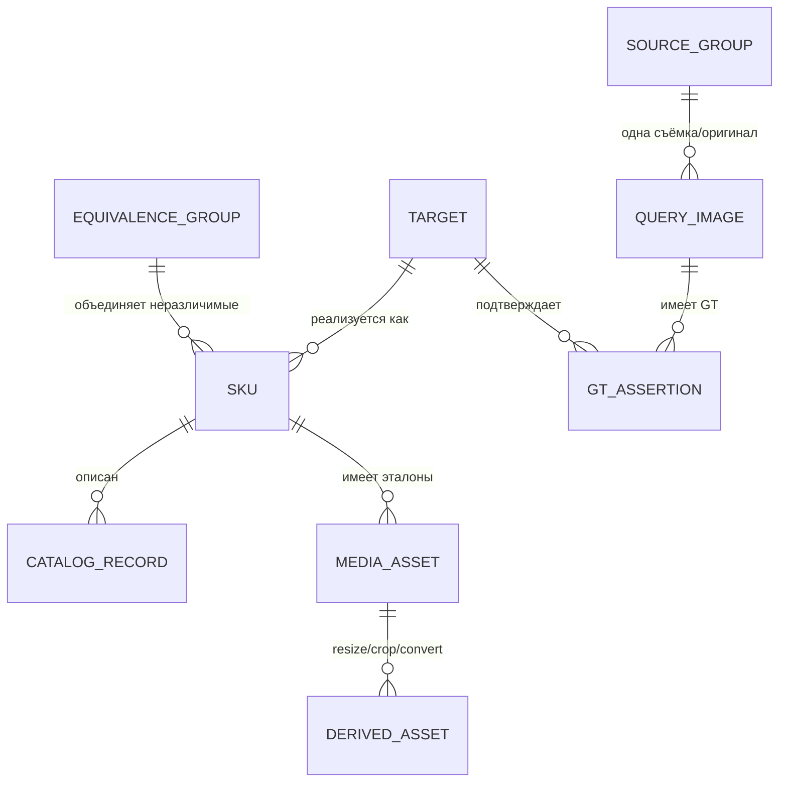
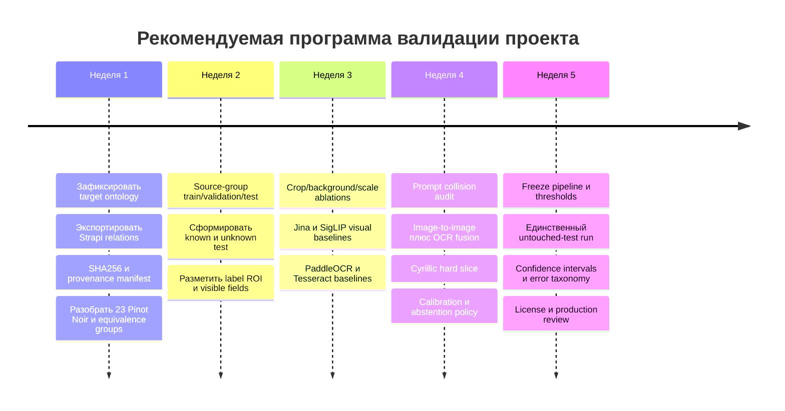

# Почему Jina CLIP не дал Top-1 на трёх фото из uploads

## Границы выводов и воспроизведение

Сравниваются три **предполагаемых** соответствия фото↔CSV: `Название фото` в CSV равно `<slug>.webp`, локальный файл uploads — тот же slug с `_` вместо `-` и суффиксом Strapi hash. CMS media relations и ручная проверка надписи/артикула не проводились. Это диагностический train-пример, а **не** независимая оценка accuracy. Исходные SHA256, результаты и Top-5: [`../artifacts/train-jina-check.json`](../artifacts/train-jina-check.json). Веса Jina CLIP v2, revision `e10d47f...`, `transformers==4.49.0`, CPU, 1024-мерные нормированные векторы, классы из всего CSV (2103), template `name`: «Фотография бутылки вина «{name}»; видна лицевая этикетка.». При подсчёте cosine используются только изображения и prompts: slug и имя файла **не** передавались модели.

| CSV-кандидат (коротко) | Размер исходника | Штатный Top-1 | Ранг CSV-кандидата | Cosine CSV-кандидата / Top-1 | После белого квадратного padding: ранг / cosine кандидата |
|---|---:|---|---:|---:|---:|
| Фанагория, «100 оттенков красного. Саперави» | 1950×7371 RGBA | Фанагория, «100 оттенков красного. Каберне» | 5 | 0.3861 / 0.4119 | **1 / 0.4224** |
| Фанагория, «100 оттенков. Шардоне» | 1950×7371 RGBA | «Левокумское белое. Ркацители» | 2 | 0.3851 / 0.3894 | **1 / 0.4012** |
| «Пино Нуар», А. Гордиенко & М. Николаев | 260×1000 RGBA | Массандра, «Мускатель чёрный» | 803 | 0.3036 / 0.3731 | **9 / 0.4172**, Top-1 другой «Пино Нуар» |

После padding Top-1 третьего фото — `valeriy-zaharin-pino-nuar-valeriy-zaharin-krasnoe-polusladkoe-105` (cosine 0.4366). Данные опыта: [`../artifacts/train-jina-padding-ablation.json`](../artifacts/train-jina-padding-ablation.json). Это **последовательная диагностическая абляция**, не подтверждённое улучшение: метод выбран после просмотра этих train-результатов, GT не верифицирован, отдельного test нет. Сравниваются ранги при одинаковых весах, тексте и списке классов; cosine не является вероятностью.

## Причины, подтверждённые кодом и измерением

1. **Потеря большей части вытянутого исходника (высокая уверенность в механизме; локальный эффект измерен).** `preprocessor_config.json`: `size=512`, `resize_mode=shortest`. Upstream `processing_clip.py` → `transform.py` использует `Resize(shortest edge)` и `CenterCrop(512×512)`. Для 1950×7371 сохраняется центральный квадрат исходных координат приблизительно `x=0…1950, y=2710…4660` — **26,5% высоты**, для 260×1000 — `y=370…630`, **26% высоты**. Содержимое вне центра не может повлиять на embedding. Это не доказывает, что конкретная надпись была обрезана: область этикетки не размечена и визуально не проверена. Но простое белое центрированное дополнение до квадрата перед тем же encoder улучшило ранг CSV-кандидата 5→1, 2→1 и 803→9. Сильное свидетельство значимости геометрии и/или масштаба, не доказательство единственной причины; padding также уменьшает долю пикселей бутылки на выходе 512×512. Не менять основной preprocessing без независимого теста; новый режим должен иметь отдельную версию image index. В диагностическом скрипте 1950×7371 дополнялось до 7371×7371 (~54 млн пикселей), что не годится как production-подготовка: при реализации надо сохранять пропорции, **сначала уменьшать** до заданного размера и ограничивать память.

2. **Недостаточность текстового определения классов (детерминированный дефект идентифицируемости).** `wineid/clip_zero_shot.py:class_prompts` использует по умолчанию только `{name}`. Для «Пино Нуар» существуют **23 разных slug с абсолютно одинаковым prompt**: их текстовые векторы одинаковы. Их невозможно ранжировать друг относительно друга на основании фото при этой конфигурации, даже если корректное изображение попадёт в общую группу. В текущем коде статус `ambiguous_prompt` срабатывает только когда *первый* найденный кандидат принадлежит такой группе; при штатном запуске ошибочный Top-1 вообще не был «Пино Нуар», поэтому статус остался `ranked_only`. Добавление проверенного производителя (`name-producer`) может снять часть коллизий, но требуется аудит оставшихся дублей и проверка способности модели распознать производителя на самих фото. Не подставлять автоматически сведения из slug/визуальных догадок.

3. **Малый отрыв правильного CSV-кандидата во втором примере и конкурирующая серия в первом (наблюдение, механизм не установлен).** Шардоне отличается от Top-1 лишь на ~0.0043 cosine; Саперави уступает другому вину той же серии Фанагории на ~0.0258. Это может отражать потерю информации при crop, визуальную похожесть серии или слабую связь CLIP с мелким текстом/сортом винограда; разделить причины по трём файлам нельзя. Глобальный embedding не читает этикетку как надёжный OCR. Без калибровки нельзя выбирать «порог уверенности» по этим числам.

4. **Слабый протокол GT и некорректный перенос на живые фото (фактор неопределённости).** Файлы из uploads — в основном прозрачные product cutouts с очень большой высотой/узкой бутылкой, не сцены съёмки. `read_image` композитит альфу на белый фон; upstream processor затем меняет геометрию. CSV↔uploads связаны по преобразованию имён, не по утверждённой CMS relation; надпись/урожай/цвет и соответствие slug не сверялись. Нельзя считать тренинговые изображения доказательством точности на `eval/queries` или отбирать по ним финальную конфигурацию. Оба направления (train cutouts и живые фото) требуют своих срезов.

## Что проверить дальше (не маскируя тюнинг под валидацию)

1. **Подтвердить GT:** получить CMS media relations; вручную проверить фото↔SKU, фронт/оборот, урожай, OCR-видимость; записать источник подтверждения и SHA. Если GT ошибочен, пересчитать диагностику до изменения модели.
2. **Независимая разметка:** validation/test по независимым съемкам и SKU, известные/неизвестные товары, отдельные группы исходных product cutouts; не допускать повторов/resizes одного asset между splits. На validation сравнить `native center crop`, `white square pad`, ROI лицевой этикетки (ручной верхний ориентир) и, при наличии, detector crop. Для index images соблюдать один и тот же режим на строении и запросе.
3. **Разрешимость каталога:** посчитать коллизии для `name`, `name-producer` и проверенных описаний видимых признаков; отделить exact SKU от линейки, учесть урожай и тип вина только там, где они есть в доверенном каталоге и видны на фото. Отчёт по неразрешимым группам — обязателен; не объявлять произвольный Top-1 верным.
4. **Модельная способность:** paired сравнение text→image, image→text, а также image→image verified reference gallery и OCR→каталог на тех же GT; отдельно ошибки текстовой читаемости, серии с похожим дизайном, прозрачности/фоновых заливок и масштаба. Не заменять доказательство качества субъективно лучшим cosine.
5. **Правило принятия:** показать Top-K, coverage/abstain и точность на известных/неизвестных; подобрать пороги и политику только на validation, один раз проверить на test. Три train-файла нельзя использовать для калибровки или заявления о production accuracy.

## Вопросы эксперту (просить конкретный эксперимент/решение)

**Данные и GT**
1. Можно ли получить прямую таблицу Strapi `wine_id/slug ↔ media_id ↔ SHA256` и ручное подтверждение соответствия для этих трёх фото? Не являются ли файлы вариантами бутылки, другой этикеткой/урожаем или ресайзом другого артикула?
2. Какова целевая единица распознавания: точный SKU/урожай, название линейки, производитель или бутылка без урожая? Что делать с 23 SKU «Пино Нуар», если на фото нет различимого текста?
3. Какие есть независимые фотосъёмки этикеток и примеры неизвестных вин? Как разделять train/validation/test по asset/source-group, чтобы product cutouts и их ресайзы не попадали в разные splits?

**Предобработка и визуальный сигнал**
4. Считать ли потерю ~74% высоты при штатном center crop ошибкой контракта для вертикальных product cutouts? Что выбрать для сравнения: белый padding, `resize_mode=longest` с явным цветом, квадратный crop бутылки, ручной ROI этикетки или detector ROI? Как разметить контроль видимости надписей после 512×512?
5. Должны ли все прозрачные product cutouts композититься на белом фоне? Есть ли в боевом вводе прозрачность/другой фон, и нужно ли отдельно измерить устойчивость к фону и масштабу?
6. Где находится лицевая этикетка на этих фото и сколько читаемых пикселей у названия/сорта на входе модели? Может ли эксперт разметить ROI и оценить сохранение текста штатным crop и padding, прежде чем интерпретировать причины ошибки?

**Модель, prompts и каталог**
7. Достаточно ли Jina CLIP global embeddings для точного SKU, или требуется OCR/hybrid/image-to-image с проверенными эталонами? Какой baseline и какие метрики считать достаточными на похожих линейках, когда сорт отличается мелким текстом?
8. Какие доверенные поля стоит включить *одинаковым способом* для всех классов: производитель, сорт, серия, год, тип? Какие поля реально видны на фото, а не только в CSV, и как избежать неверных атрибутов/коллизий prompts?
9. Для совпадающих или почти совпадающих названий следует возвращать набор эквивалентных SKU/`ambiguous`, или допустим второй этап OCR для различения? Как измерять ошибки этого второго этапа и долю отказов?
10. Нужно ли проверять multilingual text↔image alignment Jina для русских названий и мелкой кириллицы отдельно от обычной визуальной похожести? Есть ли лицензионно допустимые альтернативные backbone или задача требует ручной разметки для обучения?

**Критерий решения**
11. Какой уровень ошибок Top-1, Top-5, false accept неизвестных и abstain допустим; на каком **нетронутом test** это будет подтверждаться? Можно ли согласовать протокол до следующих экспериментов, не выбирая порог или padding по этим трём train-примерам?

# Аудит Deep Research и плана проекта распознавания винных этикеток

> **Примечание к внешнему аудиту (проверено по текущему репозиторию).** Ниже приведён аудит, сделанный без доступа к локальным данным проекта, а не подтверждённые ответы владельцев на 11 вопросов. Его утверждения об отсутствии `strapi_output0709.csv`, трёх оригинальных файлов uploads и `artifacts/train-jina-check.json` / `artifacts/train-jina-padding-ablation.json` **неверны для этого каталога**: все перечисленные файлы есть, SHA256 CSV совпадает с указанным выше, SHA256 трёх изображений совпадают с JSON, число классов `Пино Нуар` с идентичным `name`-prompt равно 23. По текущему CSV: `name` — 444 класса в 100 группах коллизий; `name-producer` — 141 класс в 64 группах. Владелец подтвердил CSV как GT **каталоговых полей и `Название фото`**. Локальная *train-диагностика* проверяема по файлам, но сопоставление переименованных uploads с записью CSV по похожему имени остаётся кандидатной media relation (1699 кандидатов, 404 unresolved в `artifacts/csv-media-links-summary.json`), а не независимой validation/test. Внешние ссылки вида `filecite...` здесь не являются локальными источниками; сообщения о новых моделях, их лицензиях и изменениях upstream требуют отдельной проверки перед внедрением. Числа в таблице «предлагаемый validation gate» — предложения автора аудита, не утверждённые продуктовые пороги. Актуальный backlog — [STATUS.md](STATUS.md).

## Резюме для принятия решения

На текущем наборе материалов **нельзя подтвердить, что Deep Research ответил на 11 поставленных вопросов**, потому что итоговый текст Deep Research не предоставлен. Единственный доступный содержательный документ — исходная диагностическая записка «Почему Jina CLIP не дал Top-1 на трёх фото из uploads». Она формулирует все 11 вопросов, содержит предварительную диагностику трёх train-примеров и предлагает будущие эксперименты, но сама прямо оговаривает отсутствие верифицированного GT, CMS media relations, ручной проверки этикеток и независимого test. fileciteturn0file0 Поэтому в соответствии с заданным правилом **вердикт по каждому из 11 пунктов — `report not provided` («отчёт не предоставлен»)**.

При этом исходная записка в целом технически сильнее обычного «плана исследования»: один из её центральных выводов — риск разрушительного center crop — независимо подтверждается upstream-конфигурацией и кодом Jina. У Jina CLIP v2 заявлен вход 512×512; конфигурация соответствующих ревизий содержит `resize_mode="shortest"` и `size=512`, а официальный `transform.py` реализует этот режим как resize по короткой стороне с последующим `CenterCrop`. citeturn17search0turn18search3turn20search0turn20search3 Для изображений 1950×7371 и 260×1000 это действительно означает, что центральный квадрат содержит соответственно около **26,46%** и **26,0%** исходной высоты. Следовательно, механизм потери примерно 74% вертикальной области реален. Но отсутствие ROI-разметки не позволяет сделать следующий причинный вывод — что именно важный текст этикетки был потерян.

Также логически верен вывод о коллизиях prompt: **если** 23 SKU действительно получают буквально одинаковую строку `Пино Нуар` и каждый класс определяется только этим текстовым embedding, их class scores относительно изображения будут одинаковыми; такой классификатор не способен идентифицировать один SKU внутри этой группы по изображению. Однако число «23» и сами строки каталога проверить нельзя: CSV/catalog export не приложен. fileciteturn0file0

Напротив, наиболее важные локальные результаты — улучшения рангов `5→1`, `2→1`, `803→9` после white padding — пока являются **не воспроизводимыми утверждениями диагностической записки**. Указанные в ней `train-jina-check.json` и `train-jina-padding-ablation.json`, три оригинальных asset и их SHA256 в предоставленные материалы не входят. fileciteturn0file0 Поэтому они могут мотивировать эксперимент, но не считаться доказательством преимущества padding.

Есть ещё один существенный production-риск, который должен быть вынесен из «модельной» части в обязательный gate: локально скачиваемые веса Jina CLIP v2 сейчас опубликованы под **CC BY-NC 4.0**; Jina отдельно указывает коммерческое использование через свой API/AWS/Azure/GCP и необходимость связаться с компанией для коммерческого использования скачанных весов. citeturn17search0 То есть для коммерческого on-premises продукта Jina CLIP v2 нельзя считать автоматически «license-safe».

Итоговая оценка состояния проекта:

| Область | Состояние сейчас | Что требуется перед заявлением о качестве |
|---|---|---|
| Покрытие исследовательского плана | **11/11 вопросов сформулированы** | Итоговый отчёт с результатами |
| Проверенный GT | **Нет** | Strapi relation + SHA256 + ручная/каталожная верификация |
| Target unit | **Не зафиксирован** | exact SKU / equivalence group / family / unknown |
| Независимый test | **Нет** | Замороженный source-group split |
| Unknown/OOD evaluation | **Нет** | Отдельный набор неизвестных вин |
| Crop-гипотеза | **Механизм подтверждён; эффект на качество не подтверждён** | ROI + paired validation ablation |
| Padding improvement | **Сообщается, но артефакты отсутствуют** | JSON/results/assets + независимая validation |
| Prompt collisions | **Механизм верен; количество не верифицировано** | Catalog dump и collision audit |
| OCR/image-to-image baselines | **Не выполнены** | Paired benchmark |
| Кириллица | **Не проверена на задаче** | Russian/Cyrillic slice |
| Acceptance thresholds | **Не зафиксированы** | Pre-registered validation→test protocol |
| Production readiness | **Не доказана** | Data/model/statistics/license gates |

Главная рекомендация: **не оптимизировать дальше Jina CLIP по трём изображениям**. Сначала превратить задачу из «найти правильный cosine» в строго определённую open-set recognition задачу с доказуемым GT, эквивалентными SKU, source-group anti-leakage, OCR/visual baselines и selective prediction.

## Основания аудита и фактчек исходной диагностики

Главная проблема текущего evidence package — смешение четырёх разных уровней доказательности.

**Первый уровень — то, что действительно подтверждается upstream.** Jina CLIP v2 является general-purpose multilingual multimodal embedding model; официальный model card описывает 512×512 vision input и совместное пространство изображений/текста. citeturn17search0 Для рассматриваемой конфигурации `preprocessor_config.json` действительно задаёт `size: 512`, `resize_mode: "shortest"`, bicubic interpolation и `fill_color: 0`. citeturn18search3 Image processor передаёт эти параметры в `image_transform`, а upstream transform для `shortest` делает resize короткой стороны и затем `CenterCrop`; режим `longest`, наоборот, использует сохранение пропорций и center crop-or-pad. citeturn20search0turn20search3

Это подтверждает геометрический диагноз, но выявляет важную проблему воспроизводимости: **preprocessing Jina CLIP v2 менялся во времени**. В одной из upstream-ревизий того же `preprocessor_config.json` присутствует `size: 384`, тогда как в другой — 512. citeturn18search7turn18search3 Поэтому строка из исходной записки «revision `e10d47f...`» должна сопровождаться сохранёнными `config.json`, `preprocessor_config.json`, revision Jina implementation и hash кода. Недостаточно записать только название модели и `transformers==4.49.0`. Иначе воспроизводимость через год не гарантирована.

Есть и ещё одна деталь, критичная для будущей абляции: upstream `longest` использует `fill_color`, а рассматриваемая конфигурация Jina задаёт `fill_color=0`. citeturn18search3turn20search0 Поэтому **`resize_mode=longest` по умолчанию не равен white square padding** из диагностического опыта. Эти условия необходимо тестировать как разные варианты: `longest+black`, `longest+white`, custom white pad и, возможно, edge/neutral padding.

**Второй уровень — математически корректные следствия локального описания.** Для вертикального изображения `W×H`, если короткая сторона `W` масштабируется до 512, а затем берётся квадратный center crop 512×512, поле зрения по исходной вертикали составляет приблизительно `W/H`. Поэтому:

| Исходник | Доля исходной высоты в center crop | Центральная потеря |
|---|---:|---:|
| 1950×7371 | 1950 / 7371 = **26,46%** | ≈73,54% |
| 260×1000 | 260 / 1000 = **26,00%** | 74,00% |

Это подтверждает корректность вычислений записки, но **не доказывает потерю названия, производителя или сорта**: для этого нужны координаты label ROI/text ROI.

**Третий уровень — локальные результаты, пока не подлежащие независимому фактчеку.** К ним относятся ранги и cosine трёх конкретных фотографий, улучшение после padding, утверждение о 23 строках `Пино Нуар`, white-alpha composite в локальном `read_image`, статус `ambiguous_prompt` и соответствие конкретных файлов конкретным CSV-строкам. Они описаны в документе, но исходные CSV, код, images и JSON-артефакты отсутствуют. fileciteturn0file0

**Четвёртый уровень — вопросы/гипотезы, а не ответы.** Именно сюда относятся почти все 11 требований: записка очень правильно спрашивает о target unit, source-group split, unknown wines, ROI, OCR, multilingual alignment и acceptance thresholds, но это ещё не evidence-backed resolution. fileciteturn0file0

Наконец, GT действительно нельзя строить только на filename convention. В Strapi relations и media fields не подставляются в REST-ответ автоматически: для получения связанных media их необходимо явно populate. citeturn18search1 Поэтому доказательством связи `wine ↔ media` должен быть export/API snapshot самой CMS relation, а не сходство slug и имени файла.

## Поэлементный аудит одиннадцати требований

В таблице «состояние записки» оценивает только имеющийся диагностический Markdown. Колонка «вердикт отчёту» вынужденно одинакова для всех строк: отдельный итоговый Deep Research report отсутствует.

| Требование | Вердикт отчёту | Состояние исходной записки | Что подтверждено | Чего конкретно не хватает |
|---|---|---|---|---|
| **1. GT: Strapi `wine_id/slug ↔ media_id ↔ SHA256`** | **report not provided** | **Недостаточно доказательств** | Записка сама признаёт, что mapping предположен по filename и CMS relation не проверена. fileciteturn0file0 Strapi требует явного `populate` relations/media. citeturn18search1 | Strapi export/API snapshot; `wine_id`, `documentId/id`, slug, `media_id`, original filename/path, bytes, dimensions, SHA256; три спорные пары; manual verification; дата/версия каталога; сами referenced JSON |
| **2. Target unit и 23 `Пино Нуар`** | **report not provided** | **Partial** | Если prompts действительно буквально одинаковы, text-only class representations не способны различить 23 класса; это логически следует из схемы scoring. Записка это корректно выявляет. fileciteturn0file0 | CSV/export, подтверждающий «23»; определение exact SKU vs vintage vs family; visible discriminators; equivalence groups; правило `ambiguous` |
| **3. Train/val/test, source groups, unknown** | **report not provided** | **Not given — только рекомендация** | Записка требует независимых splits и запрещает размещать ресайзы одного asset в разных splits. fileciteturn0file0 GroupKFold/StratifiedGroupKFold обеспечивают non-overlapping groups и подходят как механическая основа group separation. citeturn8search1turn8search11 | Manifest с `source_group_id`; замороженные split lists; lineage derivatives; capture/session IDs; distinct unknown set; leakage audit |
| **4. Preprocessing/crop contract bug** | **report not provided** | **Partial, наиболее сильный пункт** | `shortest→CenterCrop` подтверждён upstream; расчёт ≈26% сохранённой высоты корректен. citeturn18search3turn20search0 | Доказательство, что потерян именно discriminative label text; pinned exact revision; validation ablation native/pad/longest/bottle/label/detector; независимый test. Padding ranks без JSON не воспроизводятся |
| **5. Alpha/background/scale robustness** | **report not provided** | **Not given** | В записке сообщается white alpha compositing локальным `read_image`, но код не предоставлен. fileciteturn0file0 | Проверка local code; stratified benchmark alpha/white/dark/photo background; bottle scale/position perturbations; production input distribution |
| **6. Label ROI/readable pixels/info preservation** | **report not provided** | **Not given** | Записка правильно отмечает, что ROI не размечен, поэтому нельзя доказать потерю надписи. fileciteturn0file0 | Label polygon/box, text-line boxes, effective text height after preprocessing, OCR legibility, fraction ROI retained, annotation protocol/reviewer agreement |
| **7. Jina CLIP vs OCR/hybrid/image→image** | **report not provided** | **Partial formulation, no answer** | Jina позиционирует CLIP v2 как general-purpose multimodal retrieval model и прямо поддерживает image/text embeddings, включая image-to-image similarity examples. citeturn17search0 Это не является доказательством exact-SKU OCR performance | Paired benchmark на одной validation: text→image, image→image, OCR→catalog, fusion; confidence intervals; hard-series slice; runtime/resource comparison |
| **8. Prompt policy и collisions** | **report not provided** | **Partial** | Name-only prompt collision обнаружен в записке условно на локальном CSV. fileciteturn0file0 | Full prompt collision table для `name`, `name+producer`, `name+producer+series`, etc.; source/trust каждого field; visibility flag; prompt hash/version; false attributes audit |
| **9. Equivalent SKU + OCR second stage + abstain** | **report not provided** | **Not given — варианты политики** | Записка предлагает `ambiguous`/set return и OCR stage, но результатов нет. fileciteturn0file0 | Equivalence-group GT; set-valued metric; OCR confusion table; selective accuracy/coverage; unknown FAR; second-stage incremental gain |
| **10. Russian/Cyrillic + license-safe alternatives** | **report not provided** | **Not given** | Jina CLIP v2 заявляет multilingual multimodal support, но это не доказывает распознавание мелкой кириллицы на винной этикетке. citeturn17search0 Локальная лицензия v2 — CC BY-NC 4.0. citeturn17search0 | Russian-only evaluation subset; Cyrillic OCR CER/field accuracy; tiny-text slice; formal commercial license review; alternative backbone/OCR benchmark |
| **11. Fixed acceptance protocol** | **report not provided** | **Partial protocol, no acceptance result** | Записка корректно предлагает threshold selection только на validation и один untouched test. fileciteturn0file0 | Pre-registered thresholds; sample-size justification; CI method; calibration; immutable test manifest; test result; rollback criterion |

Таким образом, **ни один из одиннадцати пунктов нельзя считать закрытым evidence-backed ответом**, хотя пункт о crop уже имеет достаточно сильное техническое основание для постановки полноценной абляции.

Особенно важно не переинтерпретировать multilingual claim. Jina CLIP v2 действительно обучен как multilingual multimodal model и заявляет 89 языков для multilingual-image retrieval, но retrieval-level multilingual ability не означает автоматически ability reliably distinguish `Саперави`, `Каберне`, урожай или производителя по нескольким десяткам пикселей кириллического текста. citeturn17search0 Такой вывод можно получить только из отдельного Russian/Cyrillic label test.

Для OCR уже есть подходящие control baselines. Официальный PP-OCRv5 multilingual release включает `eslav` recognition для Russian/Belarusian/Ukrainian/English и отдельную Cyrillic-модель с Russian и другими кириллическими языками; PaddleOCR распространяется как Apache-2.0 project. citeturn22search0turn22search2turn22search3 Tesseract поддерживает UTF-8 и более 100 языков, а в официальном наборе language data есть Russian; это дешёвый, пусть и не обязательно сильнейший, контрольный OCR baseline. citeturn21search0turn3search0

На дату этого аудита существует и новый Jina-OCR-v1, выпущенный в сентябре 2026 года как end-to-end document parsing model. Он полезен как исследовательский дополнительный baseline, однако его веса также опубликованы под CC BY-NC 4.0 с требованием связаться с Jina для коммерческого использования. citeturn23academia12turn23search7 То есть он не решает лицензионный вопрос автоматически.

## Корректная постановка задачи и целевая архитектура

Ключевой концептуальный дефект текущей постановки — попытка получить единственный `exact SKU Top-1` даже там, где наблюдаемое изображение **не содержит информации, достаточной для различения SKU**. Это превращает ошибки идентифицируемости каталога в «ошибки модели».

Целевую единицу следует определить иерархически:

| Выход | Когда допустим | Как оценивать |
|---|---|---|
| `exact_sku` | Производитель/линейка/вариант/год или другой discriminative признак действительно видим и подтверждён GT | Exact Top-1/Top-5 |
| `equivalence_group` | Несколько SKU имеют практически одинаковый наблюдаемый фронт или различаются невидимыми полями | Group Top-1 / set accuracy |
| `ambiguous {A,B,…}` | Доказательств недостаточно, но candidate set мал | Set recall + set size |
| `unknown` | Вино отсутствует в frozen known catalog | False-accept / true-reject |
| `abstain` | Confidence/evidence ниже validation threshold | Coverage / accepted precision |

Для группы из 23 `Пино Нуар` правило должно быть жёстким: **не разрешать произвольный exact Top-1 только потому, что один из одинаковых prompts первым оказался в массиве**. Если producer/year/series отсутствуют на фото или нечитабельны, правильным результатом является equivalence group или `ambiguous`, а не «ошибка модели».

Предлагаемая схема сущностей:

Из этой модели следует важное anti-leakage правило: все derivatives одного исходного asset и вся одна photo/session group должны жить только в одном split. Scikit-learn group splitters прямо предназначены для сохранения непересекающихся groups. citeturn8search1turn8search11 При этом нужны **два разных теста**, потому что они отвечают на разные вопросы:

**Known-SKU/new-photo test** допускает тот же SKU в reference gallery, но запрещает тот же исходный asset, его crop/resize и ту же сессию съёмки. Он измеряет реальную задачу распознавания известного каталога.

**Unknown/unseen test** содержит вина, которых нет в frozen recognition catalog/gallery. Он измеряет способность отказаться от ложного известного ответа. Желательно, чтобы unknown содержал не только очевидно посторонние бутылки, но и визуально похожие серии — иначе open-set результат окажется искусственно простым.

Для модели я бы не выбирал сейчас «один лучший backbone». Наиболее оправданная архитектура — **ROI + три независимых сигнала + calibrated decision layer**:

| Вариант | Что даёт | Главный риск | Роль в исследовании |
|---|---|---|---|
| **Jina CLIP v2 text→image** | Быстрый semantic catalog retrieval, multilingual text space, 512 input. citeturn17search0 | Prompt collisions; tiny text; CC BY-NC local weights | Сохранить как baseline/branch |
| **Jina/SigLIP image→image** | Не требует текстового описания класса; сравнивает query с проверенными бутылками | Нужна качественная reference gallery; visual near-duplicates | Обязательный baseline |
| **SigLIP 2** | Современный image-text encoder; официальный Google checkpoint `large-patch16-512` опубликован под Apache-2.0 и предназначен в том числе для image-text retrieval. citeturn21search1turn21search6 | Не доказано, что он лучше на вине/кириллице | License-friendlier multimodal comparator |
| **PaddleOCR → catalog** | Явно извлекает discriminative strings; PP-OCRv5 поддерживает Russian/Cyrillic. citeturn22search0 | Blur, curved label, tiny glyphs, stylized fonts | Обязательный OCR baseline |
| **Tesseract → catalog** | Простой воспроизводимый контроль; UTF-8/много языков. citeturn21search0 | Вероятно слабее на сложной scene text | Cheap lower/control baseline |
| **Jina-OCR-v1** | Современный end-to-end OCR/document parser. citeturn23academia12 | Новый; документная задача ≠ винная этикетка; CC BY-NC | Research-only comparator без отдельной коммерческой лицензии |
| **ROI + visual retrieval + OCR fusion** | Может использовать дизайн, текст и отказ одновременно | Сложнее pipeline и calibration | **Предпочтительная production-кандидатура после validation** |

Главное здесь — слово **кандидатура**. Нельзя априори объявить hybrid лучшим: это должно следовать из paired validation ablation.

Prompt policy также надо превратить из строки кода в версионируемый data contract. Каждый prompt должен строиться только из полей, имеющих подтверждённый catalog provenance. Для каждого field следует хранить `trusted=true/false`, а отдельно — `expected_visible_on_front=true/false`. Нельзя улучшать prompt, например, годом или сортом, который известен из базы, но принципиально отсутствует на фото, а затем интерпретировать хороший text-image match как визуальное распознавание этого атрибута.

## Экспериментальная матрица и абляции

Правильный следующий эксперимент — не ещё несколько ручных фотографий, а **одна frozen validation matrix**, где изменяется только один фактор за раз. Все модели должны получать одни и те же query IDs, один и тот же catalog snapshot и один GT.

| ID | Изменение относительно baseline | Что проверяет | Основная метрика |
|---|---|---|---|
| A0 | Jina native `shortest + center crop`, name-only | Исходная точка | Top-1/5, coverage |
| A1 | Custom white square padding | Гипотеза текущей записки | Paired ΔTop-1 |
| A2 | `longest + black fill` | Upstream alternative geometry | Paired ΔTop-1 |
| A3 | `longest + white fill` | Геометрия отдельно от цвета padding | Paired ΔTop-1 |
| A4 | Bottle bounding-box crop | Убирает лишний background, сохраняет bottle | Top-1 + robustness |
| A5 | Manual front-label ROI | Верхняя граница пользы точного ROI | Top-1/OCR field accuracy |
| A6 | Detector label ROI | Реалистичный production ROI | Top-1 + detector failure |
| A7 | Alpha→white/dark/neutral + photo backgrounds, разные scales | Background/scale robustness | Worst-slice accuracy |
| A8 | `name` vs `name+producer` vs visible trusted fields | Prompt collisions | Collision count + Top-1 |
| A9 | Verified-reference image→image | Убирает text prompt bottleneck | Top-1/5 |
| A10 | PaddleOCR/Tesseract → catalog | Проверяет текст как основной discriminant | SKU accuracy, field CER/match |
| A11 | Visual retrieval + OCR fusion | Complementarity signals | Accepted precision/coverage |
| A12 | Russian/Cyrillic-only slice | Проверяет реальную multilingual задачу | Top-1 + OCR field accuracy |

A1 особенно нельзя выбирать финальной конфигурацией только потому, что он улучшил три уже просмотренных train-примера. Это именно post-hoc selection, на что исходная записка сама корректно указывает. fileciteturn0file0

Каждая геометрия должна иметь отдельный versioned index. Например, нельзя построить reference embeddings с native center crop, а query embeddings — с padding, а затем считать эксперимент чистой проверкой padding. Если production pipeline предполагает одинаковую трансформацию reference/query, это должно быть одинаково и в эксперименте.

Для ROI предлагаю помимо box хранить измеряемые показатели preservation:

`label_retained_fraction = area(label_ROI ∩ model_FOV) / area(label_ROI)`

`text_line_height_after_transform_px`

`visible_discriminative_fields = {brand, producer, wine_name, grape, vintage, volume, ...}`

Это позволит отличить две причины: «модель не понимает видимый текст» от «pipeline вообще не передал модели этот текст».

Для Russian slice нельзя ограничиваться общей точностью. Нужны отдельные strata: кириллица крупная/мелкая, mixed Cyrillic+Latin, stylized font, curved label, glare/blur и визуально близкие линейки. PaddleOCR уже предоставляет Russian/Cyrillic recognition models, поэтому такая проверка имеет реальный external OCR comparator. citeturn22search0

## Manifest, статистика и критерий приёмки

Минимальный immutable manifest должен быть артефактом проекта, а не вспомогательным CSV. Рекомендуемая схема:

| Поле | Обязательность | Назначение |
|---|---|---|
| `sample_id` | Да | Стабильный ID строки |
| `asset_sha256` | Да | Идентичность байтов |
| `bytes`, `mime`, `width`, `height`, `has_alpha` | Да | Проверка file-level provenance |
| `source_system` | Да | Strapi/uploads/camera/etc. |
| `strapi_media_id` / `documentId` | Для CMS asset | Прямая CMS relation |
| `wine_id`, `slug` | Для known | Catalog relation |
| `catalog_snapshot_id` | Да | Версия universe кандидатов |
| `target_id` | После GT | Recognition target |
| `equivalence_group_id` | При необходимости | Неидентифицируемые SKU |
| `source_group_id` | Да | Anti-leakage unit |
| `capture_session_id` | Для live photo | Независимость съёмок |
| `derivative_of_sha256` | Для resize/crop | Asset lineage |
| `role` | Да | reference/query |
| `split` | Да | train/validation/test |
| `known_unknown` | Да | Open-set evaluation |
| `label_roi` | Validation/test | Information preservation |
| `visible_fields` | Validation/test | Что реально видно |
| `gt_source` | Да | CMS/manual/OCR/etc. |
| `gt_reviewer`, `gt_timestamp` | Да | Auditability |
| `gt_confidence/status` | Да | verified/disputed |
| `preprocess_version` | При embedding | Reproducibility |
| `model_revision` | При embedding | Reproducibility |
| `rights/license` | Да | Production legality |

Для каждого из трёх первоначальных изображений доказательная запись должна выглядеть примерно как цепочка

`catalog_snapshot → wine_id/slug → Strapi relation → media_id → original asset → SHA256 → derivative lineage → manual front-label verification`.

Filename similarity допустима только как средство поиска кандидата, но не как финальный GT.

Метрики следует считать минимум в четырёх режимах.

**Known recognition:** exact-SKU Top-1 и Top-5, а также equivalence-aware Top-1/Top-5. Помимо micro-average по изображениям нужен macro view по SKU/series, иначе 50 фотографий лёгкой бутылки могут скрыть провал на редких SKU.

**Selective recognition:** `coverage = accepted / all` и `accepted precision = correct / accepted`. Система, достигшая 99% точности ценой отказа в 90% запросов, и система с теми же 99% при 85% coverage — принципиально разные продукты.

**Open-set:** `unknown false accept rate = unknown queries accepted as a known target / all unknown queries`. Threshold должен оптимизироваться на validation unknown и после freeze переноситься без изменения на test.

**Calibration:** raw cosine не следует трактовать как probability of correctness. Калибровку необходимо обучать на отдельной validation/calibration части. Современный `CalibratedClassifierCV` прямо требует разделять данные обучения модели и данные для калибровки для уже обученного estimator и поддерживает sigmoid, isotonic и temperature scaling. citeturn18search5 Reliability/calibration curves должны показываться рядом с selective metrics, а не заменяться одним «порогом cosine».

Для uncertainty предлагается следующий protocol:

| Величина | Интервал / тест |
|---|---|
| Top-1, Top-5, accepted precision, coverage | 95% cluster bootstrap по `source_group_id`; дополнительно по SKU для robustness |
| ΔTop-1 двух pipelines на одинаковых queries | Paired cluster bootstrap |
| Binary correct/wrong для двух pipelines | McNemar как дополнительный paired test, если observational units независимы |
| Unknown FAR | Exact binomial CI при независимых source groups; cluster bootstrap при повторных shots |
| Calibration | Reliability plot на validation и untouched test, без refitting на test |

SciPy реализует bootstrap confidence intervals, включая BCa и paired resampling. citeturn16search3turn16search14 Для обычной независимой binomial proportion SciPy предоставляет exact Clopper–Pearson, Wilson и Wilson-with-continuity-correction intervals. citeturn16search0 Statsmodels предоставляет exact/chi-square McNemar test для paired binary outcomes. citeturn8search17

При повторных кадрах одной бутылки naïve image-level bootstrap завысит эффективный объём выборки. Поэтому здесь рекомендация — ресэмплировать целиком `source_group_id`, а не отдельные crops.

Практическое следствие для unknown test: при **нуле false accepts** односторонняя 95%-я верхняя граница для независимой binomial rate равна приблизительно

`1 − 0.05^(1/n)`.

Чтобы даже при нуле ошибок верхняя граница была ниже 1%, требуется примерно **299 независимых unknown units**. Это хорошо иллюстрирует, почему «0 ошибок на 20 неизвестных бутылках» нельзя представлять как доказательство FAR <1%. Exact-binomial methodology доступна в SciPy. citeturn16search0

Численные product gates сейчас невозможно вывести из данных: неизвестна стоимость ошибочного SKU и стоимость abstain. Но как **предварительный инженерный контракт для обсуждения, а не установленный факт**, разумно начать со следующего:

| Metric | Предлагаемый validation gate | Untouched-test gate |
|---|---:|---:|
| Exact-SKU Top-1 на identifiable known | ≥95% | estimate ≥95%, lower 95% CI ≥93% |
| Exact-SKU Top-5 | ≥99% | lower 95% CI ≥98% |
| Accepted precision | ≥98% | lower 95% CI ≥97% |
| Coverage при этом precision | ≥80% | ≥80% |
| Unknown FAR | ≤1% target | upper one-sided 95% CI ≤2%; для safety-critical use — жёстче |
| Forced exact answer внутри unidentifiable equivalence group | **0 по политике** | **0 по политике** |
| Calibration | reliability проверена; threshold frozen | без recalibration |

Эти цифры должны быть заменены владельцем продукта после фиксации business cost matrix. Более фундаментальный принцип важнее конкретных процентов: **все thresholds, preprocessing choices, fusion weights, prompt policy и equivalence rules замораживаются до открытия final test**.

Production gate должен требовать одновременно четыре «зелёных» состояния: GT/provenance complete; statistical acceptance met; deployment reproducible; licenses cleared. Модель с 99% Top-1, но с недоказанным GT или несовместимой коммерческой лицензией, production-ready не является.

## План исправления и итоговый вывод

Рекомендуемая последовательность работ намеренно ставит data contract перед модельным тюнингом:

В первую фазу необходимо включить не только новые данные, но и восстановление исходной диагностики: приложить три оригинальных asset, SHA256, CSV/catalog snapshot, точный Strapi mapping, обе упомянутые JSON-абляции, commit/revision model processor и код запуска. Только после этого результаты `5→1`, `2→1`, `803→9` становятся аудируемыми. fileciteturn0file0

Во вторую фазу надо зафиксировать ответ на главный вопрос проекта: распознаётся **SKU**, **наблюдаемое оформление бутылки** или **catalog product family**. Для неразличимых SKU correctness должен определяться equivalence policy, а не порядком tie-breaking.

В третью и четвёртую фазу Jina CLIP следует рассматривать не как систему, качество которой надо «дотянуть», а как один из paired baselines. Сам Jina CLIP v2 рассчитан на general multilingual multimodal retrieval; это сильное основание использовать его в candidate retrieval, но не доказательство достаточности для fine-grained SKU recognition. citeturn17search0 SigLIP 2 даёт Apache-2.0 multimodal comparator, а PaddleOCR — Apache-2.0 Russian/Cyrillic OCR branch. citeturn21search1turn22search0turn22search3

При этом лицензирование надо решить **до** production freeze: локальные Jina CLIP v2 weights — CC BY-NC 4.0, коммерческие варианты Jina описывает отдельно. citeturn17search0 Новейший Jina-OCR-v1 имеет ту же фундаментальную проблему для самостоятельного коммерческого использования без отдельного соглашения. citeturn23search7

Итоговая оценка исходного материала поэтому двойственная. **Как диагностический план он хороший:** он правильно обнаруживает потенциально разрушительный preprocessing contract, prompt non-identifiability, GT uncertainty и опасность tuning-on-three-examples. **Как ответ Deep Research на 11 вопросов он отсутствует:** ни GT, ни splits, ни ROI, ни architecture benchmark, ни Cyrillic validation, ни acceptance test фактически не предъявлены. fileciteturn0file0

Наиболее сильный вывод, который уже можно принять без дополнительных экспериментов: **текущий exact-SKU Top-1 нельзя использовать как показатель production quality**. В существующей постановке он одновременно смешивает ошибки GT, уничтожение визуальной информации preprocessing'ом, текстовые prompt collisions, каталоговую неидентифицируемость и собственно ошибки embedding model. После разнесения этих факторов через provenance manifest, equivalence-aware target, source-group test, ROI/OCR/image-to-image ablations и calibrated abstention задача станет измеримой — и только тогда untouched test сможет дать содержательный ответ о готовности системы к production.